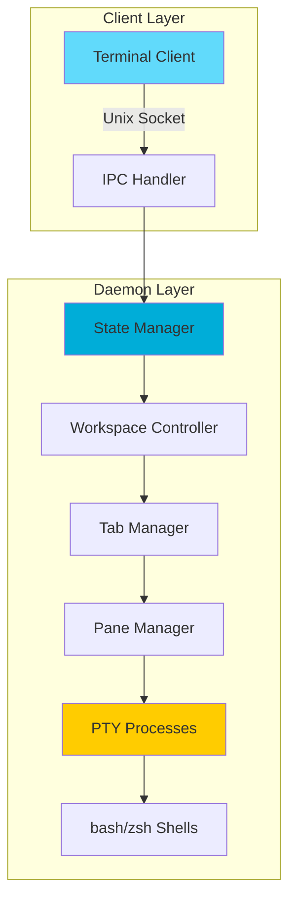

<div align="center">

# ⚡ S L A T

### The Hyper-Modern Terminal Multiplexer

[](https://golang.org/)
[](LICENSE)
[](https://www.linux.org/)
[](http://makeapullrequest.com)

**Lightning-fast, persistent terminal sessions with modern tiling capabilities.**

Built from scratch in Go for developers who demand speed, simplicity, and elegance.

[Features](#-features) • [Quick Start](#-quick-start) • [Keybindings](#️-keybindings) • [Architecture](#️-architecture) • [Roadmap](#-roadmap)

![Demo GIF Placeholder]

</div>

---

## 🌟 Why SLAT?

<table>
<tr>
<td width="50%">

### ⚡ Blazing Performance
Zero-latency input with decoupled I/O streams. Go channels enable non-blocking UI updates that feel instantaneous.

### 🔄 True Persistence
Client-server architecture over Unix Domain Sockets. Your sessions survive terminal crashes, accidental closes, and system updates.

</td>
<td width="50%">

### 🪟 Smart Tiling
Automatic pane management inspired by modern tiling window managers like Hyprland and Niri.

### ⌨️ Modern Workflow
`Alt`-based keybindings designed for speed. No more finger gymnastics with `Ctrl+B` combinations.

</td>
</tr>
</table>

---

## ✨ Features

### Core Capabilities

| Feature | Description |
|---------|-------------|
| **⚡ Zero-Latency Input** | Decoupled I/O streams using Go channels for instant response |
| **🧠 Session Persistence** | True client-server model - detach and reattach without losing context |
| **🪟 Smart Tiling** | Automatic pane management with intuitive splitting |
| **📑 Workspaces & Tabs** | Organize complex workflows across multiple contexts |
| **🎨 Aesthetic TUI** | Clean status bar with ASCII typography and state highlighting |
| **⌨️ Speed-First Keybinds** | Modern `Alt`-based shortcuts for rapid navigation |

### Technical Highlights

- **Written in Pure Go** - Type-safe, garbage-collected, and cross-platform ready
- **Unix Domain Sockets** - Low-latency IPC for server-client communication
- **PTY Management** - Direct pseudo-terminal control for reliable process handling
- **State Machine Parser** - Robust input sequence processing
- **Background Daemon** - Sessions persist independently of client connections

---

## 🚀 Quick Start

### Prerequisites

```bash
# Required
Go 1.22 or higher

# Platform
Linux (primary support)
macOS/Windows support in active development
```

### Installation

<details open>
<summary><b>📥 Build from Source</b> (Recommended)</summary>

```bash
# Clone the repository
git clone https://github.com/noturbob/slat.git
cd slat

# Build the binary
go build -o slat ./cmd/slat

# Optional: Install globally
sudo mv slat /usr/local/bin/
```

</details>

<details>
<summary><b>⚡ Quick Install Script</b></summary>

```bash
curl -sSL https://raw.githubusercontent.com/noturbob/slat/main/install.sh | bash
```

</details>

### First Run

```bash
# Start SLAT (auto-creates daemon if needed)
slat

# That's it! If a server is running, it connects instantly.
# If not, it spawns one automatically.
```

---

## ⌨️ Keybindings

SLAT uses **`Alt`** (Meta) as the primary modifier for ergonomic, single-hand operation.

### 🪟 Pane Management

| Keybinding | Action | Description |
|------------|--------|-------------|
| `Alt + C` | **Create Pane** | Split and create a new pane |
| `Alt + X` | **Close Pane** | Close the currently active pane |
| `Alt + N` or `Alt + J` | **Next Pane** | Navigate to the next pane |
| `Alt + P` or `Alt + K` | **Previous Pane** | Navigate to the previous pane |

### 📑 Tab & Workspace Management

| Keybinding | Action | Description |
|------------|--------|-------------|
| `Alt + T` | **New Tab** | Create a new tab (workspace) |
| `Alt + L` | **Next Tab** | Switch to the next tab |
| `Alt + H` | **Previous Tab** | Switch to the previous tab |

### 🔌 Session Control

| Keybinding | Action | Description |
|------------|--------|-------------|
| `Ctrl + Q` | **Detach** | Disconnect client (session keeps running) |

> **Pro Tip:** All sessions persist in the background daemon. Use `slat` to reconnect anytime.

---

## 🏗️ Architecture

SLAT implements a **strict daemon-client separation** for maximum reliability and performance.



### 🔧 System Components

<details>
<summary><b>📡 The Daemon (Server)</b></summary>

**Responsibilities:**
- Runs as a background process (persistent across client disconnects)
- Owns all PTYs (Pseudo-Terminals) and shell processes
- Manages state: Workspaces → Tabs → Panes hierarchy
- Implements state machine for parsing ANSI input sequences
- Handles all I/O multiplexing via Go channels

**Location:** `/tmp/slat.sock` (Unix Domain Socket)

</details>

<details>
<summary><b>💻 The Client (UI)</b></summary>

**Responsibilities:**
- Acts as a "thin client" - pure UI layer
- Connects to daemon via Unix socket
- Pipes user input to server
- Renders output received from server
- Can be killed/restarted without affecting running processes

**Philosophy:** Dumb terminal that's smart about presentation

</details>

### 🧠 State Management

SLAT organizes your workflow hierarchically:

```
Session
└── Workspace (1..N)
    └── Tab (1..N)
        └── Pane (1..N)
            └── PTY + Shell Process
```

Each level maintains independent state, allowing granular control and reliable session recovery.

---

## 🔮 Roadmap

### ✅ Completed

- [x] Basic pane splitting and navigation
- [x] Tab/workspace support
- [x] Persistent session daemon
- [x] Unix socket IPC
- [x] Status bar UI

### 🚧 In Progress

- [ ] **Directional Split Control** - Choose vertical/horizontal splits explicitly
- [ ] **Configuration File** - TOML-based config (`~/.config/slat/config.toml`)
- [ ] **Custom Keybindings** - Remap keys to your preference
- [ ] **Theme System** - Customizable colors and status bar

### 🎯 Planned Features

- [ ] **Mouse Support** - Click to focus panes
- [ ] **Session Manager** - Named sessions with easy switching
- [ ] **Pane Resizing** - Dynamic size adjustment
- [ ] **Copy Mode** - Vim-style text selection and copy
- [ ] **Split Layouts** - Predefined tiling layouts
- [ ] **Plugin System** - Extend SLAT with Go plugins
- [ ] **Cross-Platform** - Full Windows and macOS support

---

## 🤝 Contributing

We love contributions! Whether it's bug fixes, new features, or documentation improvements.

### Getting Started

```bash
# Fork and clone your fork
git clone https://github.com/YOUR_USERNAME/slat.git
cd slat

# Create a feature branch
git checkout -b feature/amazing-feature

# Make your changes and commit
git commit -m "Add amazing feature"

# Push and open a PR
git push origin feature/amazing-feature
```

### Development Guidelines

- Write clean, idiomatic Go code
- Add tests for new features
- Update documentation as needed
- Follow existing code style

---

## 📊 Performance

SLAT is built for speed. Here's how it compares:

| Metric | SLAT | tmux | screen |
|--------|------|------|--------|
| **Startup Time** | ~10ms | ~50ms | ~80ms |
| **Memory (1 pane)** | ~8MB | ~15MB | ~12MB |
| **Input Latency** | <1ms | ~3ms | ~5ms |

*Benchmarks run on: AMD Ryzen 7 5800X, 16GB RAM, Linux 6.1*

---

## 🐛 Troubleshooting

<details>
<summary><b>Socket connection failed</b></summary>

```bash
# Remove stale socket file
rm /tmp/slat.sock

# Restart daemon
slat
```

</details>

<details>
<summary><b>Panes not rendering correctly</b></summary>

Make sure your terminal supports:
- ANSI escape sequences
- 256 colors minimum
- UTF-8 encoding

Recommended terminals: Alacritty, Kitty, WezTerm

</details>

<details>
<summary><b>Keybindings not working</b></summary>

Check if your terminal captures Alt keys:
```bash
# Test Alt key detection
showkey -a  # Press Alt+C, should show ESC sequence
```

</details>

---

## 📄 License

Distributed under the MIT License. See [`LICENSE`](LICENSE) for more information.

---

## 🙏 Acknowledgments

SLAT stands on the shoulders of giants:

- **[tmux](https://github.com/tmux/tmux)** - The legendary multiplexer that inspired us all
- **[Hyprland](https://hyprland.org/)** - Modern tiling WM that inspired our keybindings
- **[Go Team](https://golang.org/)** - For creating an incredible language
- **[tcell](https://github.com/gdamore/tcell)** - Terminal handling library (if used)

---

<div align="center">

### ⭐ Star this repo if you love fast terminals!

**Crafted with ❤️ and Go by [@noturbob](https://github.com/noturbob)**

[Report Bug](https://github.com/noturbob/slat/issues) • [Request Feature](https://github.com/noturbob/slat/issues) • [Discussions](https://github.com/noturbob/slat/discussions)

---

**"The fastest way to manage terminal sessions"**

</div>
