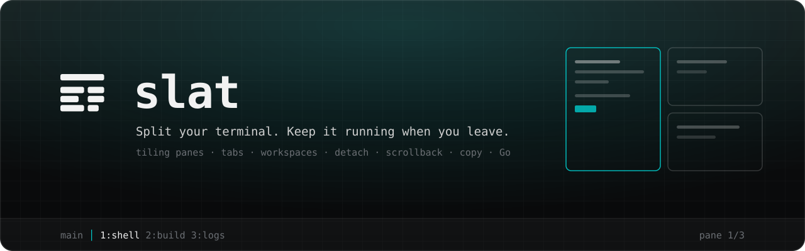
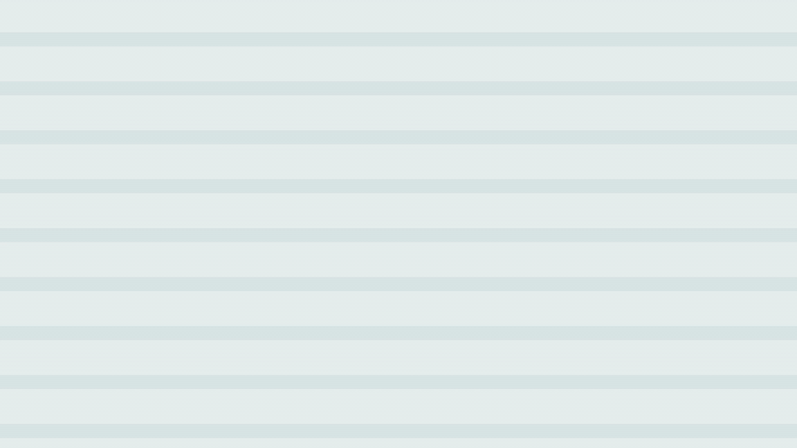

<div align="center">



<br>

A terminal multiplexer with tiling panes, tabs and workspaces, written in Go.

[](https://go.dev/)
[](LICENSE)
[](#requirements)
[](https://ko-fi.com/bobbyanthene)

[Website](https://noturbob.github.io/slat/) · [Install](#install) · [Keys](#keys) · [Configuration](#configuration) · [How it works](#how-it-works)

</div>

<p align="center">
  
</p>

<p align="center"><sub>A real session, captured through slat's own emulator and cut into a film — not a mock-up.</sub></p>

---

slat tiles one terminal into panes, tabs and workspaces. Your shells live in a
small background process, so closing the window — or losing the SSH
connection — doesn't end anything. Run `slat` again and it's all there,
output included.

- **Panes** — split left/right or top/bottom, move between them by direction, swap, resize, zoom
- **Tabs and workspaces** — group tabs into named workspaces, rename them in place
- **Detach and reattach** — `d` disconnects; running `slat` from any terminal reattaches
- **Scroll and copy mode** — page back through a pane's output, search it vim-style, select characters or lines and yank them to your system clipboard (over `ssh` too, via OSC 52)
- **Every pane keeps its own screen** — `clear`, vim or htop in one pane never touch another, and nothing is lost when you split, close or switch
- **Fast** — only changed cells are sent to your terminal; half a million lines of output render in about a third of a second
- **New panes open where you are** — a split starts in the directory of the pane you split from (Linux)
- **Drivable from scripts and AI agents** — `slat ls`, `run`, `capture` and `wait --for idle` let anything outside the terminal work a session and know when a pane needs a human ([details](#scripting-and-agents))
- **Move panes around** — walk a pane through the layout like a tiling window manager; the swap slides instead of jumping
- **Rice it** — five palettes or your own colours, six border styles or your own
  glyphs, a status bar you write as a format string, and animation timing and
  easing you can tune or switch off entirely
- **One checked config file** — mistakes are reported when you run `slat`, not ignored

## Install

| Platform | How |
| --- | --- |
| Debian / Ubuntu | [signed apt repository](#debian--ubuntu) |
| Arch Linux | [package from the latest release](#arch-linux) |
| Fedora / RHEL | [one `dnf` command](#fedora--rhel) |
| macOS, anything with Go | [`go install`](#with-go) |
| Try it without installing | [Docker](#try-it-in-docker) |

Every package comes for both `amd64` and `arm64`.

### Debian / Ubuntu

Add the repository once; after that, `apt upgrade` keeps slat up to date.

```bash
# 1. Trust the repository's signing key
curl -fsSL https://noturbob.github.io/slat/apt/slat.gpg \
  | sudo tee /usr/share/keyrings/slat.gpg > /dev/null

# 2. Add the repository
repo=https://noturbob.github.io/slat/apt
echo "deb [signed-by=/usr/share/keyrings/slat.gpg] $repo stable main" \
  | sudo tee /etc/apt/sources.list.d/slat.list

# 3. Install
sudo apt update
sudo apt install slat
```

<details>
<summary>Key fingerprint, or install a single <code>.deb</code> instead</summary>

<br>

The repository key's fingerprint is:

```text
9040 A503 5BDC A04A 55C3  719A D1A8 1309 D2F2 0668
```

To install one release without adding the repository:

```bash
curl -LO https://github.com/noturbob/slat/releases/latest/download/slat_linux_amd64.deb
sudo apt install ./slat_linux_amd64.deb
```

</details>

### Arch Linux

```bash
curl -LO https://github.com/noturbob/slat/releases/latest/download/slat_linux_amd64.pkg.tar.zst
sudo pacman -U slat_linux_amd64.pkg.tar.zst
```

An AUR package (`yay -S slat`) is on the way.

### Windows

Download `slat_windows_amd64.zip` from the
[latest release](https://github.com/noturbob/slat/releases/latest), unzip it and
put `slat.exe` on your `PATH`. Windows 10 1809 or later is required (that's when
ConPTY arrived). Panes run `cmd.exe` by default; for something else:

```toml
# %USERPROFILE%\.config\slat\config.toml
shell = "powershell.exe"
```

Windows Terminal is recommended — the old conhost window can't render
everything slat draws.

### Fedora / RHEL

```bash
sudo dnf install \
  https://github.com/noturbob/slat/releases/latest/download/slat_linux_amd64.rpm
```

### With Go

Works on Linux and macOS:

```bash
go install github.com/noturbob/slat/cmd/slat@latest
```

<details>
<summary>Other ways: prebuilt binaries, or build from source</summary>

<br>

Prebuilt binaries for Linux and macOS are on the
[releases page](https://github.com/noturbob/slat/releases).

To build from a checkout:

```bash
make build      # ./bin/slat
make install    # into $(go env GOPATH)/bin
```

</details>

### Try it in Docker

```bash
docker run -it --rm ghcr.io/noturbob/slat
```

The shells run inside the container, not on your machine, and the container
stops when you detach, so this is for trying slat out. Install it natively for
real use. (The image is published from the next release onwards.)

### First run

```bash
slat
```

The first run starts the background daemon; later runs attach to it.
Press <kbd>Ctrl</kbd>+<kbd>S</kbd> then <kbd>?</kbd> inside slat to see every key.

## Keys

Press the **prefix** (default <kbd>Ctrl</kbd>+<kbd>S</kbd>), then one key.
Everything else goes straight to your shell — including <kbd>Ctrl</kbd>+<kbd>C</kbd>.
Press the prefix twice to send it to the shell. Prefix then <kbd>?</kbd> shows
every key inside slat.

### Panes

| Key | Action |
| --- | --- |
| `v` / `h` | Split left / right, top / bottom |
| `o` / `O` | Next / previous pane |
| arrows, or `k` `j` `H` `L` | Pane above / below / left / right |
| `s` | Swap with the next pane |
| `m` | Move mode: `h` `j` `k` `l` walk the pane around, `q` leaves |
| `<` `>` `K` `J` | Move the pane left / right / up / down |
| `+` / `-` | Grow / shrink the pane |
| `=` | Equalize all sizes |
| `z` | Zoom the pane to full size (toggle) |
| `x` | Close the pane |
| `[` or PageUp | Scroll and copy mode (see below) |

### Tabs

| Key | Action |
| --- | --- |
| `c` | New tab |
| `n` / `p` | Next / previous tab |
| `1`–`9` | Go to tab N |
| `,` | Rename the tab |
| `X` | Close the tab and all its panes |

### Workspaces

| Key | Action |
| --- | --- |
| `W` | New workspace |
| `w` / `P` | Next / previous workspace |
| `$` | Rename the workspace |

### Session

| Key | Action |
| --- | --- |
| `d` | Detach — the session keeps running |
| `q` | Quit — ends every shell |
| `?` | Show all keys |

### Scroll and copy mode

`[` (or PageUp) scrolls back through a pane's own history. The view is
anchored to the output, so it holds still while the program keeps writing.

| Key | Action |
| --- | --- |
| `k` `j` `h` `l`, arrows | Move the cursor; the view follows it |
| `Ctrl`+`u` / `Ctrl`+`d` | Half a screen up / down |
| `Ctrl`+`b` / `Ctrl`+`f`, PageUp / PageDown | A screen up / down |
| `g` / `G` | Oldest line / back to the live screen |
| `0` / `$` | Start / end of the line |
| `/` `?` | Search up / down — smart case; the cursor moves to the match |
| `n` / `N` | Next / previous match |
| `v` / `V` | Select characters / whole lines |
| `y` | Copy the selection and leave |
| `Esc` | Drop the selection, then leave |
| `q` | Leave |

Copying uses OSC 52, which asks your terminal to put the text on the system
clipboard — so it works over `ssh`, where slat runs on the far machine and
the clipboard is on yours. Some terminals refuse OSC 52 or need it enabled
(`set -g set-clipboard on` territory); for those, name a local command:

```toml
[copy]
osc52   = true          # ask the terminal; the only way that works over ssh
command = "wl-copy"     # …and/or pipe it locally: xclip -sel clip, pbcopy
```

## Scripting and agents

Every command below talks to a running session over its socket, so scripts — and
AI coding agents — can drive slat without a terminal attached. Nothing is sent
anywhere: slat has no network code.

```console
$ slat ls
*1   idle     1:shell    bash    ~/src/slat
 2   working  1:build    go      ~/src/slat

$ slat pane new --cmd 'go test ./...'   # new pane, your focus stays put
$ slat wait 3 --for idle --timeout 5m   # block until it finishes
$ slat capture 3 --lines 20             # read what it printed
```

| Command | What it does |
| --- | --- |
| `slat ls` | every pane, with what each one is doing |
| `slat status [PANE]` | one pane's status |
| `slat pane new [--split v\|h] [--cwd D] [--cmd C] [--target P] [--focus]` | split a pane |
| `slat pane close PANE` | close a pane |
| `slat send PANE TEXT [--enter] [--key KEY]` | type into a pane |
| `slat run PANE COMMAND...` | send a command and press Enter |
| `slat capture PANE [--lines N] [--history]` | read a pane's text |
| `slat wait PANE --for idle\|input\|exit\|text=REGEX [--timeout 60s]` | block until something happens |

`PANE` is an id from `slat ls`, or `active` (the default). `--json` on any
command prints one object with a `schema` field. Exit codes: **0** ok,
**1** error, **2** timed out, **3** that pane is gone.

A pane's status is one of four, which is what makes `wait` useful:

- **idle** — the pane's own shell has the terminal: the command finished.
- **working** — a program is running.
- **input** — something has gone quiet on a question (`[y/N]`, a password
  prompt), so an agent waiting for a build wakes up instead of hanging. Shell
  builtins count: `read -p "Overwrite? [y/N] "` is detected even though the
  shell itself is the foreground process, because the line doesn't end the way
  a prompt does.
- **exited** — the pane's program is gone.

When a pane starts waiting for input, its tab is marked `2:shell ?` in the
status bar, and slat can run a command so you don't have to watch:

```toml
[agent]
on_input = "notify-send \"slat: pane %p needs input\" %c"
```

`%p` is the pane id, `%t` its tab, `%s` the status and `%c` the pane's last
line. Values are shell-quoted for you, so a prompt containing a quote stays
text. The hook runs detached; its output goes to the daemon log, never to your
screen.

Tune the detection under `[agent]` in the config; see
[docs/design/agent-cli.md](docs/design/agent-cli.md) for the full design.

## Configuration

slat reads `~/.config/slat/config.toml` (or `$XDG_CONFIG_HOME/slat/config.toml`).
Every setting is optional:

```toml
prefix     = "C-a"        # Ctrl + a letter, or C-\ C-] C-^ C-_
shell      = "/bin/zsh"   # default: $SHELL
status_bar = true
scrollback = 5000         # lines kept per pane; 0 turns it off
animations = true         # false turns every animation off

[agent]                   # how `slat status` reads a pane (see above)
settle      = "750ms"     # quiet for this long after output = idle
input_after = "10s"       # quiet for this long on a prompt = waiting for input

[theme]
name = "gruvbox"          # default, gruvbox, nord, rose-pine, mono
accent = "#fabd2f"        # override any single colour

[borders]
style = "rounded"         # sharp, rounded, heavy, double, dashed, none
# vertical = "┃"          # …or set any glyph yourself

[animation]
split  = "90ms"           # a new pane appearing; 0 turns it off
move   = "120ms"          # two panes trading places
easing = "out-cubic"      # linear, out-quad, out-cubic, out-back
reveal = "curtain"        # curtain or none
glyph  = "░"

[status]
left  = " {workspace} │ {tabs}"
right = "{badge} pane {pane}/{panes}  {time} "
tab   = " {index}:{name}{alert} "
alert = " ●"

[keybinds]
split-vertical   = "|"
split-horizontal = "-"
resize-shrink    = "_"    # "-" was given away above
zoom             = ""     # "" unbinds a command
```

- `[theme]` colours are `bg`, `fg`, `dim`, `accent`, `border`, `tab_bg`,
  `tab_fg`, `tab_active_bg` and `tab_active_fg`, written as a colour name, a
  palette index (0-255) or `#rrggbb`. Only what slat draws is themed — pane
  contents keep whatever colours the programs in them use.
- `[status]` takes `left`, `right`, `tab` and `alert`. The sides accept
  `{workspace}` `{workspace_index}` `{workspace_count}` `{workspaces}` `{tabs}`
  `{tab}` `{tabs_count}` `{pane}` `{panes}` `{badge}` `{time}` `{seconds}`
  `{date}`; `tab` accepts `{index}` `{name}` `{alert}`. Everything else is
  literal text, so a Nerd Font glyph goes straight in — and each placeholder is
  drawn in the colour that suits it, so there's no colour markup to write.
- A mistake anywhere — an unknown colour, a glyph two columns wide, a
  placeholder that doesn't exist, an easing curve that doesn't either — is
  reported when you run `slat`, never quietly drawn.
- **Fonts belong to your terminal, not to slat.** slat draws characters; which
  font paints them is Kitty's, Alacritty's or WezTerm's business. Point that at
  a Nerd Font and its glyphs work here like any other character.
- Ready-made setups live in [`docs/rices/`](docs/rices/) — copy one and edit it,
  or send yours in.
- Keybinds you don't set keep their defaults.
- Giving a default key to another command takes it away from the default
  command, so bindings never silently collide.
- An unknown setting, an unknown command name, a key that isn't a single
  character, or two commands on one key is an error, shown when you run `slat`.

[`config.example.toml`](config.example.toml) lists every command with its default.

## How it works

```text
 terminal ── slat (client) ──unix socket──▶ slat daemon
   raw keys ─────────────────────────────▶   ├─ workspaces / tabs / layout tree
   ◀── only the changed cells ─────────────  ├─ per-pane terminal emulator
                                             └─ shells on PTYs
```

- **Daemon.** The first `slat` re-executes itself as a background daemon that owns
  every shell. Its socket lives in `$XDG_RUNTIME_DIR` (or the temp dir) and is
  only accessible to you. Attaching from a second terminal takes over from the
  first, like `tmux attach -d`. The daemon's own errors go to the `.log` file
  next to its socket.
- **Emulation.** Each pane's output is fed into slat's own terminal emulator
  (`internal/vt`), which keeps that pane's screen. It handles the xterm features
  shells and full-screen programs use: colors (16, 256 and 24-bit), wide
  characters and emoji, scroll regions, the alternate screen, line drawing and
  cursor queries.
- **Rendering.** On every change slat composes a frame from the panes, borders,
  status bar and overlays, compares it with what your terminal already shows,
  and sends only the difference. Since frames are built from state rather than
  patched step by step, a split, close, resize or reattach can't leave stale
  or missing text behind.
- **Input modes.** The active pane's cursor-key mode and bracketed paste are
  mirrored onto your terminal, so arrow keys in vim and multi-line pastes into
  your shell behave as they do outside slat.

### Source layout

```text
cmd/slat/        entry point: starts or attaches to the daemon
internal/
  daemon/        socket server, attach / detach, session lifetime
  client/        raw mode, alternate screen, stdin/stdout ⇄ daemon
  proto/         length-prefixed frames from client to daemon
  app/           the session: input → actions, frame composition
  vt/            terminal emulator for each pane
  ui/            frame, diffing renderer, status bar, help, borders
  session/       workspaces, tabs, focus, removing dead panes
  layout/        binary-tree tiling
  pane/          a shell on a PTY with its emulator
  input/         prefix key and command table
  config/        TOML loading and validation
website/         the site at noturbob.github.io/slat (Next.js, built by CI)
docs/design/     how the agent CLI was designed
docs/rices/      ready-made configurations, one of which the tests read
packaging/aur/   the AUR package
packaging/apt/   builds the signed apt repository
```

None of `website/`, `docs/` artwork, `packaging/` or `.github/` reaches the
source archive — [`.gitattributes`](.gitattributes) keeps `git archive` (and
so the Debian tarball) down to what actually builds slat.

Releases are built by [GoReleaser](.goreleaser.yaml) when a `v*` tag is pushed:
binaries, `.deb`, `.rpm` and Arch packages for Linux and macOS on amd64 and arm64.
The release then republishes the website and the apt repository to GitHub Pages
([`pages.yml`](.github/workflows/pages.yml)), signed with the `APT_GPG_PRIVATE_KEY` secret.

`make test` runs `go vet` and the tests with the race detector. The tests in
`internal/app` drive real shells through splits, closes, overlays and
workspace changes and check what a terminal would display.

## Limitations

- Mouse events aren't passed to programs in panes.
- A session doesn't survive a reboot: the daemon holds your shells in
  memory, so it outlives a closed window or a dropped SSH connection, not a
  restart.
- On Windows, ConPTY has no foreground process group, so a pane's status
  comes from output timing alone: `slat status` says idle or working, never
  which program is running, and `slat ls` shows the directory a pane started
  in rather than where its shell has since moved.

## Requirements

- Go 1.23+ to build
- Linux, macOS, or Windows 10 1809 and later

## Support

slat is free and always will be. If it saves you time, you can
[buy me a coffee on Ko-fi](https://ko-fi.com/bobbyanthene).

## License

MIT
